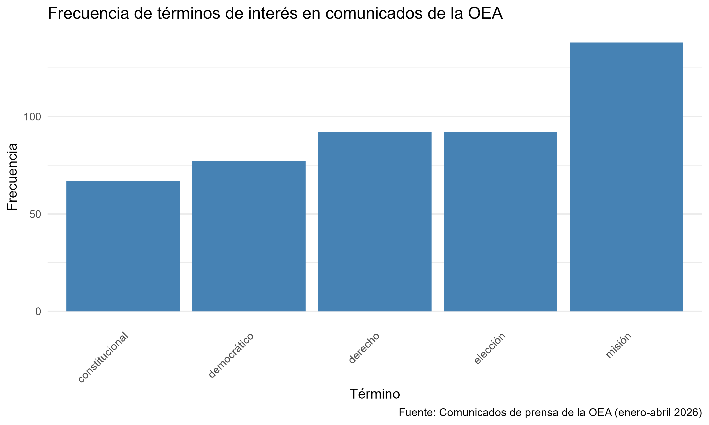

## Introducción

Este informe analiza los comunicados de prensa de la Organización de los Estados Americanos (OEA) publicados entre enero y abril de 2026. El objetivo es identificar los temas predominantes en la agenda de la organización durante ese período.

## Pregunta de investigación

¿Cuáles son los temas más frecuentes en los comunicados de prensa de la OEA durante el primer cuatrimestre de 2026?

## Metodología

Se realizó un web scraping de la página oficial de la OEA, extrayendo los comunicados de prensa del primer cuatrimestre de 2026. El texto fue procesado mediante lematización y eliminación de stopwords. Posteriormente, se construyó una Matriz de Frecuencia de Términos (DTM) para identificar los términos más relevantes en el contexto institucional de la organización: misión, derecho, democrático, elección, constitucional.

## Análisis

```{r}
library(here)
source(here("TP2/scripts/scraping_oea.R"))
source(here("TP2/scripts/processing.R"))
source(here("TP2/scripts/metrics_figures.R"))
```

## Resultados e interpretación



La OEA es una organización que tiene como principales objetivos la promoción y defensa de la democracia de los Estados americanos, la protección de los derechos humanos, la observación de procesos electorales, el fomento de la seguridad y el combate al crimen organizado y el impulso del desarrollo económico y social. Por lo tanto, las palabras más frecuentes en sus comunicados de prensa con muy coherentes.

A partir del top 5 de las palabras más usadas en los comuicados de la organización, podemos notar que la OEA está realmente comprometida con la democracia. Particularmente la palabra *misión* es usada repetidas veces (138) para referirse a observación en elecciones o de fortalecimiento de instituciones democráticas. Con esto también se relaciona el uso repetido de la palabra *elección* (92)y *democrática* (77). Por su parte, la palabra *derecho* se ha usado principalmente para hacer énfasis en el respeto de los derechos humanos en diferentes países, como por ejemplo Guatemala. A su vez, la palabra *constitucional* se ha usado para acentuar el respeto a las normas e instar a herramientas constitucionales para castigar diferentes comportamientos.

A grandes rasgos, en este prier cuatrimestre del año, la OEA puso el acento en la promoción de la democracia y sus instituciones a través de misiones y de la porposición de elementos constitucionales. A su vez, no deja de instar al respeto de los derechos humanos y el respeto de las normas.
